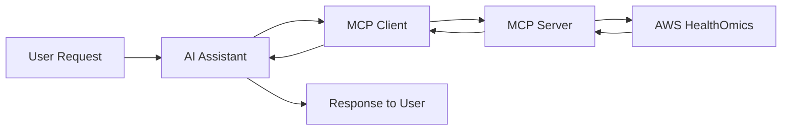

# Agentic Generative AI tutorial using MCP

This document explains how you can use Agentic AI tools connected to an MCP server to create workflows and interact with the [AWS HealthOmics](https://docs.aws.amazon.com/omics/latest/dev/what-is-healthomics.html) service using natural language prompts.

## What is MCP?

**Model Context Protocol (MCP)** is an open standard that enables AI assistants to securely connect to external data sources and tools. Think of it as a universal adapter that allows AI models to interact with various services, databases, and applications in a standardized way.

### Key Concepts

**MCP Server**: A service that exposes specific capabilities (tools, resources, prompts) to AI assistants. For example, an AWS HealthOmics MCP server provides tools to create workflows, start runs, and analyze results.

**MCP Client**: The AI assistant or application that connects to MCP servers to access their capabilities. Popular clients include Claude Desktop, [Kiro IDE](https://kiro.dev/), [Kiro CLI](https://kiro.dev/cli/), and other AI development environments.

**Tools**: Functions that the AI can call to perform actions, like creating a workflow or querying a database.


### Why MCP Matters for Genomics

In the context of AWS HealthOmics and genomics workflows, MCP provides several key benefits:

1. **Natural Language Interface**: Instead of learning complex CLI commands or APIs, you can describe what you want to accomplish in plain English.

2. **Workflow Automation**: AI assistants can automatically create, configure, and execute complex genomics pipelines based on your requirements.

3. **Intelligent Troubleshooting**: When workflows fail, the AI can analyze logs, identify issues, and suggest solutions.

4. **Resource Optimization**: AI can analyze workflow performance and recommend optimizations for cost and runtime efficiency.

5. **Knowledge Integration**: The AI has access to both your specific data and general genomics best practices, providing contextual guidance.

### How It Works



When you ask an AI assistant to "create a GATK workflow for variant calling," the process flows like this:

1. **User Request**: You describe your genomics task in natural language
2. **AI Processing**: The assistant understands your intent and determines what actions are needed
3. **MCP Communication**: The assistant calls appropriate MCP tools (e.g., `CreateWorkflow`, `StartRun`)
4. **Service Execution**: The MCP server translates these calls into AWS HealthOmics API requests
5. **Result Processing**: The AI assistant receives the results and presents them in a user-friendly format

### Example Use Cases

- **"Create a germline variant calling workflow using GATK best practices"**
- **"Start a run of the germline variant calling workflow with these FASTQ files"**
- **"Why did my last run fail and how can I fix it?"**
- **"Analyze the performance of my last 5 runs of workflow 123456 and suggest improvements"**
- **"Convert this WDL workflow to run on HealthOmics"**

## Getting Started

For this tutorial we will deploy Kiro CLI (the MCP client) on an EC2 instance but you can equally install Kiro CLI on your personal machine and you can use the HealthOmics MCP server with any Agentic AI tool that is capable of using MCP.

1. In the console or via the AWS CLI, start a t3.large Amazon EC2 instance using the latest Amazon Linux 2023 AMI.
2. In the console or via the AWS CLI, attach an IAM role with the minimum policy:
    ```
    {
        "Version": "2012-10-17",
        "Statement": [
            {
                "Effect": "Allow",
                "Action": [
                    "omics:ListWorkflows",
                    "omics:CreateWorkflow",
                    "omics:GetWorkflow",
                    "omics:CreateWorkflowVersion",
                    "omics:ListWorkflowVersions",
                    "omics:StartRun",
                    "omics:ListRuns",
                    "omics:GetRun",
                    "omics:ListRunTasks",
                    "omics:GetRunTask",
                    "logs:DescribeLogGroups",
                    "logs:DescribeLogStreams",
                    "logs:GetLogEvents",
                    "ssm:GetParametersByPath"
                ],
                "Resource": "*"
            },
            {
                "Effect": "Allow",
                "Action": [
                    "iam:PassRole"
                ],
                "Resource": "arn:aws:iam::*:role/HealthOmicsExecutionRole*"
            }
        ]
    }
    ```
    The above policy is very minimal and covers the permissions required the core MCP server tools. You will likely want to add additional permissions so that Kiro CLI can use additional tools to interact with other relevant resources like S3, IAM, and ECR.

3. Once the EC2 instance is running SSH into the machine.
4. The HealthOmics MCP server is most easily run using the uv Python package manager. Install this using:
    ```bash
    curl -LsSf https://astral.sh/uv/install.sh | sh
    ```
5. Install the most recent version of Python using `uv` and verify that the installed version is >= 3.10 using `uvx`:
    ```bash
    uv python install
    uvx python -V
    ```
6. Now install the Kiro CLI tool:
    ```bash
    curl -fsSL https://cli.kiro.dev/install | bash
    ```

7. Start Kiro-CLI and login:

   ```bash
   Welcome to Kiro CLI, let's get you signed in!

   Press enter to continue to the browser or esc to cancel
   ```

    Press enter

   ```
       ? Select login method ›
    ❯ Use for Free with Builder ID
      Use for Free with Google or GitHub
      Use with Pro license
   ```
    
   Select your preferred login method. For the best experience a [Professional license](https://kiro.dev/pricing/) is recommended. However, you may use a free license according to the restrictions of that tier.

   Complete the remaining answers depending on your developer ID or license as appropriate. If you are presented with an authentication URL, copy that into a browser and follow the steps on the associated page.

   Once successfully logged in you should see a startup message similar to:

    ```
        Logged in successfully
    ⠀⠀⠀⠀⠀⠀⠀
    ⠀⠀⠀⠀⠀⠀⠀     ⢀⣴⣶⣶⣦⡀⠀⠀⠀⢀⣴⣶⣦⣄⡀⠀⠀⢀⣴⣶⣶⣦⡀⠀⠀⢀⣴⣶⣶⣶⣶⣶⣶⣶⣶⣶⣦⣄⡀⠀⠀⠀⠀⠀⠀⢀⣠⣴⣶⣶⣶⣶⣶⣦⣄⡀⠀⠀⠀⠀⠀⠀⠀⠀⠀
    ⠀⠀⠀⠀⠀⠀⠀    ⢰⣿⠋⠁⠈⠙⣿⡆⠀⢀⣾⡿⠁⠀⠈⢻⡆⢰⣿⠋⠁⠈⠙⣿⡆⢰⣿⠋⠁⠀⠀⠀⠀⠀⠀⠀⠀⠈⠙⠻⣦⠀⠀⠀⠀⣴⡿⠟⠋⠁⠀⠀⠀⠈⠙⠻⢿⣦⠀⠀⠀⠀⠀⠀⠀
    ⠀⠀⠀⠀⠀⠀⠀    ⢸⣿⠀⠀⠀⠀⣿⣇⣴⡿⠋⠀⠀⠀⢀⣼⠇⢸⣿⠀⠀⠀⠀⣿⡇⢸⣿⠀⠀⠀⢠⣤⣤⣤⣤⣄⠀⠀⠀⠀⣿⡆⠀⠀⣼⡟⠀⠀⠀⠀⣀⣀⣀⠀⠀⠀⠀⢻⣧⠀⠀⠀⠀⠀
    ⠀⠀⠀⠀⠀⠀⠀    ⢸⣿⠀⠀⠀⠀⣿⡿⠋⠀⠀⠀⢀⣾⡿⠁⠀⢸⣿⠀⠀⠀⠀⣿⡇⢸⣿⠀⠀⠀⢸⣿⠉⠉⠉⣿⡇⠀⠀⠀⣿⡇⠀⣼⡟⠀⠀⠀⣰⡿⠟⠛⠻⢿⣆⠀⠀⠀⢻⣧⠀⠀⠀⠀
    ⠀⠀⠀⠀⠀⠀⠀    ⢸⣿⠀⠀⠀⠀⠙⠁⠀⠀⢀⣼⡟⠁⠀⠀⠀⢸⣿⠀⠀⠀⠀⣿⡇⢸⣿⠀⠀⠀⢸⣿⣶⣶⡶⠋⠀⠀⠀⠀⣿⠇⢰⣿⠀⠀⠀⢰⣿⠀⠀⠀⠀⠀⣿⡆⠀⠀⠀⣿⡆
    ⠀⠀⠀⠀⠀⠀⠀    ⢸⣿⠀⠀⠀⠀⠀⠀⠀⠀⠹⣷⡀⠀⠀⠀⠀⢸⣿⠀⠀⠀⠀⣿⡇⢸⣿⠀⠀⠀⠀⠀⠀⠀⠀⠀⠀⠀⣠⣼⠟⠀⢸⣿⠀⠀⠀⢸⣿⠀⠀⠀⠀⠀⣿⡇⠀⠀⠀⣿⡇
    ⠀⠀⠀⠀⠀⠀⠀    ⢸⣿⠀⠀⠀⠀⠀⣠⡀⠀⠀⠹⣷⡄⠀⠀⠀⢸⣿⠀⠀⠀⠀⣿⡇⢸⣿⠀⠀⠀⠀⣤⣄⠀⠀⠀⠀⠹⣿⡅⠀⠀⠸⣿⠀⠀⠀⠸⣿⠀⠀⠀⠀⠀⣿⠇⠀⠀⠀⣿⠇
    ⠀⠀⠀⠀⠀⠀⠀    ⢸⣿⠀⠀⠀⠀⣾⡟⣷⡀⠀⠀⠘⣿⣆⠀⠀⢸⣿⠀⠀⠀⠀⣿⡇⢸⣿⠀⠀⠀⠀⣿⡟⣷⡀⠀⠀⠀⠘⣿⣆⠀⠀⢻⣧⠀⠀⠀⠹⣷⣦⣤⣤⣾⠏⠀⠀⠀⣼⡟
    ⠀⠀⠀⠀⠀⠀⠀    ⢸⣿⠀⠀⠀⠀⣿⡇⠹⣷⡀⠀⠀⠈⢻⡇⠀⢸⣿⠀⠀⠀⠀⣿⡇⢸⣿⠀⠀⠀⠀⣿⡇⠹⣷⡀⠀⠀⠀⠈⢻⡇⠀⠀⢻⣧⠀⠀⠀⠀⠉⠉⠉⠀⠀⠀⠀⣼⡟
    ⠀⠀⠀⠀⠀⠀⠀    ⠸⣿⣄⡀⢀⣠⣿⠇⠀⠙⣷⡀⠀⢀⣼⠇⠀⠸⣿⣄⡀⢀⣠⣿⠇⠸⣿⣄⡀⢀⣠⣿⠇⠀⠙⣷⡀⠀⠀⢀⣼⠇⠀⠀⠀⠻⣷⣦⣄⡀⠀⠀⠀⢀⣠⣴⣾⠟
    ⠀⠀⠀⠀⠀⠀⠀    ⠀⠈⠻⠿⠿⠟⠁⠀⠀⠀⠈⠻⠿⠿⠟⠁⠀⠀⠈⠻⠿⠿⠟⠁⠀⠀⠈⠻⠿⠿⠟⠁⠀⠀⠀⠈⠻⠿⠿⠟⠁⠀⠀⠀⠀⠀⠈⠙⠻⠿⠿⠿⠿⠟⠋⠁
    
    
    Jump into building with Kiro:
    
    1. Ask a question or describe a task
    2. Use /context add <file> to provide Kiro with additional info
    3. Connect to external tools with by using /mcp
    
    Use /help for more information and happy coding!
    
    Model: Auto (/model to change)
```

7. Quit Kiro CLI (`/quit`) to add the HealthOmics MCP server":
    ```
    /quit
    ```
    
   followed by

   ```bash
   kiro-cli mcp add \
      --name "awslabs.aws-healthomics-mcp-server" \
      --scope global \
      --command "uvx" \
      --args "awslabs.aws-healthomics-mcp-server@latest"
   ```

9. Verify that the MCP server has been configured in the “global” scope:
    ```bash
    kiro-cli mcp list
    ```

    You should see the following output:
    ```bash
    🤖 default:
    
      kiro_default
        • awslabs.aws-healthomics-mcp-server uvx
    
    📄 workspace:
    
      kiro_planner
    (empty)
    ```

10. Launch Kiro CLI in “chat” mode":
    ```bash
    kiro-cli chat
    ```

    The chat should open and indicate the MCP server has successfully loaded. On the first launch it may take up to 30 seconds to start the server as it pulls the required package from PyPi. Subsequent launches should complete much faster.

```
✓ awslabs.aws-healthomics-mcp-server loaded in 1.46 s

⠀⠀⠀⠀⠀⠀⠀
⠀⠀⠀⠀⠀⠀⠀     ⢀⣴⣶⣶⣦⡀⠀⠀⠀⢀⣴⣶⣦⣄⡀⠀⠀⢀⣴⣶⣶⣦⡀⠀⠀⢀⣴⣶⣶⣶⣶⣶⣶⣶⣶⣶⣦⣄⡀⠀⠀⠀⠀⠀⠀⢀⣠⣴⣶⣶⣶⣶⣶⣦⣄⡀⠀⠀⠀⠀⠀⠀⠀⠀⠀
⠀⠀⠀⠀⠀⠀⠀    ⢰⣿⠋⠁⠈⠙⣿⡆⠀⢀⣾⡿⠁⠀⠈⢻⡆⢰⣿⠋⠁⠈⠙⣿⡆⢰⣿⠋⠁⠀⠀⠀⠀⠀⠀⠀⠀⠈⠙⠻⣦⠀⠀⠀⠀⣴⡿⠟⠋⠁⠀⠀⠀⠈⠙⠻⢿⣦⠀⠀⠀⠀⠀⠀⠀
⠀⠀⠀⠀⠀⠀⠀    ⢸⣿⠀⠀⠀⠀⣿⣇⣴⡿⠋⠀⠀⠀⢀⣼⠇⢸⣿⠀⠀⠀⠀⣿⡇⢸⣿⠀⠀⠀⢠⣤⣤⣤⣤⣄⠀⠀⠀⠀⣿⡆⠀⠀⣼⡟⠀⠀⠀⠀⣀⣀⣀⠀⠀⠀⠀⢻⣧⠀⠀⠀⠀⠀
⠀⠀⠀⠀⠀⠀⠀    ⢸⣿⠀⠀⠀⠀⣿⡿⠋⠀⠀⠀⢀⣾⡿⠁⠀⢸⣿⠀⠀⠀⠀⣿⡇⢸⣿⠀⠀⠀⢸⣿⠉⠉⠉⣿⡇⠀⠀⠀⣿⡇⠀⣼⡟⠀⠀⠀⣰⡿⠟⠛⠻⢿⣆⠀⠀⠀⢻⣧⠀⠀⠀⠀
⠀⠀⠀⠀⠀⠀⠀    ⢸⣿⠀⠀⠀⠀⠙⠁⠀⠀⢀⣼⡟⠁⠀⠀⠀⢸⣿⠀⠀⠀⠀⣿⡇⢸⣿⠀⠀⠀⢸⣿⣶⣶⡶⠋⠀⠀⠀⠀⣿⠇⢰⣿⠀⠀⠀⢰⣿⠀⠀⠀⠀⠀⣿⡆⠀⠀⠀⣿⡆
⠀⠀⠀⠀⠀⠀⠀    ⢸⣿⠀⠀⠀⠀⠀⠀⠀⠀⠹⣷⡀⠀⠀⠀⠀⢸⣿⠀⠀⠀⠀⣿⡇⢸⣿⠀⠀⠀⠀⠀⠀⠀⠀⠀⠀⠀⣠⣼⠟⠀⢸⣿⠀⠀⠀⢸⣿⠀⠀⠀⠀⠀⣿⡇⠀⠀⠀⣿⡇
⠀⠀⠀⠀⠀⠀⠀    ⢸⣿⠀⠀⠀⠀⠀⣠⡀⠀⠀⠹⣷⡄⠀⠀⠀⢸⣿⠀⠀⠀⠀⣿⡇⢸⣿⠀⠀⠀⠀⣤⣄⠀⠀⠀⠀⠹⣿⡅⠀⠀⠸⣿⠀⠀⠀⠸⣿⠀⠀⠀⠀⠀⣿⠇⠀⠀⠀⣿⠇
⠀⠀⠀⠀⠀⠀⠀    ⢸⣿⠀⠀⠀⠀⣾⡟⣷⡀⠀⠀⠘⣿⣆⠀⠀⢸⣿⠀⠀⠀⠀⣿⡇⢸⣿⠀⠀⠀⠀⣿⡟⣷⡀⠀⠀⠀⠘⣿⣆⠀⠀⢻⣧⠀⠀⠀⠹⣷⣦⣤⣤⣾⠏⠀⠀⠀⣼⡟
⠀⠀⠀⠀⠀⠀⠀    ⢸⣿⠀⠀⠀⠀⣿⡇⠹⣷⡀⠀⠀⠈⢻⡇⠀⢸⣿⠀⠀⠀⠀⣿⡇⢸⣿⠀⠀⠀⠀⣿⡇⠹⣷⡀⠀⠀⠀⠈⢻⡇⠀⠀⢻⣧⠀⠀⠀⠀⠉⠉⠉⠀⠀⠀⠀⣼⡟
⠀⠀⠀⠀⠀⠀⠀    ⠸⣿⣄⡀⢀⣠⣿⠇⠀⠙⣷⡀⠀⢀⣼⠇⠀⠸⣿⣄⡀⢀⣠⣿⠇⠸⣿⣄⡀⢀⣠⣿⠇⠀⠙⣷⡀⠀⠀⢀⣼⠇⠀⠀⠀⠻⣷⣦⣄⡀⠀⠀⠀⢀⣠⣴⣾⠟
⠀⠀⠀⠀⠀⠀⠀    ⠀⠈⠻⠿⠿⠟⠁⠀⠀⠀⠈⠻⠿⠿⠟⠁⠀⠀⠈⠻⠿⠿⠟⠁⠀⠀⠈⠻⠿⠿⠟⠁⠀⠀⠀⠈⠻⠿⠿⠟⠁⠀⠀⠀⠀⠀⠈⠙⠻⠿⠿⠿⠿⠟⠋⠁

╭─────────────────────────────── Did you know? ────────────────────────────────╮
│                                                                              │
│        You can enable custom tools with MCP servers. Learn more with         │
│                                    /help                                     │
│                                                                              │
╰──────────────────────────────────────────────────────────────────────────────╯

Model: Auto (/model to change)
```

You can use the /tools command to list the tools that are available to Kiro. The list will also include some default tools but should also include those provided by the HealthOmics MCP server. Overtime we will add additional tools so you may see a more longer list

```
awslabs.aws-healthomics-mcp-server (MCP)
- AnalyzeAHORunPerformance     not trusted
- CreateAHOWorkflow            not trusted
- CreateAHOWorkflowVersion     not trusted
- DiagnoseAHORunFailure        not trusted
- GenerateAHORunTimeline       not trusted
- GetAHORun                    not trusted
- GetAHORunEngineLogs          not trusted
- GetAHORunLogs                not trusted
- GetAHORunManifestLogs        not trusted
- GetAHORunTask                not trusted
- GetAHOSupportedRegions       not trusted
- GetAHOTaskLogs               not trusted
- GetAHOWorkflow               not trusted
- GetSupportedFileTypes        not trusted
- LintAHOWorkflowBundle        not trusted
- LintAHOWorkflowDefinition    not trusted
- ListAHORunTasks              not trusted
- ListAHORuns                  not trusted
- ListAHOWorkflowVersions      not trusted
- ListAHOWorkflows             not trusted
- PackageAHOWorkflow           not trusted
- SearchGenomicsFiles          not trusted
- StartAHORun                  not trusted
```

When Kiro CLI is first launched the tools provided by the HealthOmics MCP server are not automatically trusted. This means that Kiro CLI will need to ask your permission to use a tool each time it attempts to use it. As you gain confidence with the tools you might choose to trust some actions such as the Get* , List* , AnalyzeAHORunPerformance , and DiagnoseAHORunFailure tools as they don’t modify resources in HealthOmics. You should only trust other resources if you are comfortable with Kiro autonomously performing actions like creating workflows in your account and starting workflow runs. Remember that generative AI tools can make mistakes so it is best to verify what actions they are taking.

In addition to the tools listed about, Kiro CLI also has access to bash command and AWS CLI commands which have appropriate preconfigured trust levels (which you can modify if needed).

At this point you can chat with the CLI, based on your prompts and the context of your chat, it will decide when it is appropriate to use any of it’s available tools and call them with appropriate parameters. The MCP server will provide the agent with the relevant information about your HealthOmics workflows, runs, logs etc which will inform the response generated by the agent. For example, you could ask it to list your most recent run failure.

The following is the result of a real interaction with Kiro CLI using the HealthOmics MCP server.

```
> What was my last workflow run that failed?

> I'll check your recent workflow runs to find the last one that failed.
Running tool ListAHORuns with the param (from mcp server: awslabs.aws-healthomics-mcp-server)
 ⋮  {
 ⋮    "status": "FAILED",
 ⋮    "max_results": 1
 ⋮  }

Allow this action? Use 't' to trust (always allow) this tool for the session. [y/n/t]:
```

Kiro has determined that the best way to answer the question is to call the ListAHORuns tool where the run status is FAILED. You may agree to this by pressing y or reject it with n . If you reject a request Kiro will usually suggest something else or perhaps conclude that it cannot answer with the information available. If you want to trust the ListAHORuns tool for the remainder of the chat session you can press t. This will run the tool and will not prompt you again when invoking the same tool in this session.

Kiro summarizes the information it gets from the MCP server and produces a response.

```
> Your last failed workflow run was:

- **Run ID**: 6848827
- **Name**: whole-genome-single-sample-run-v4.3.3-test-1
- **Status**: FAILED
- **Workflow ID**: 4565227
- **Created**: November 21, 2025 at 6:21 PM UTC
- **Started**: November 21, 2025 at 6:21 PM UTC
- **Stopped**: November 21, 2025 at 7:22 PM UTC
- **Duration**: ~1 hour

Would you like me to diagnose why this run failed or get more details about it?
 ▸ Time: 16s
```

I replied with the prompt “what caused the error”?, based on the current context Kiro determines that best tool to use is DiagnoseAHORunFailure and that the most appropriate run ID to use is 6848827 because it just identified that as a failed run. Because the tool doesn’t require modification to any of my HealthOmics resources I am comfortable trusting it for the rest of the session.

```
> what caused the error?

> The workflow failed because of a Java Virtual Machine error in the ScatterIntervalList task. Here's what happened:

Root Cause:
The task tried to use a Java VM option MaxRAMPercentage=75 that isn't recognized by the Java version in the container image
broadinstitute/genomes-in-the-cloud:2.3.1-1512499786.

Error Details:
Unrecognized VM option 'MaxRAMPercentage=75'
Error: Could not create the Java Virtual Machine.
Error: A fatal exception has occurred. Program will exit.


What This Means:
The MaxRAMPercentage option was introduced in Java 8u191. The container image you're using likely has an older Java version
that doesn't support this option.

How to Fix:
1. Update the container image to use a newer version that includes a compatible Java version (Java 8u191 or later, or Java 11+)
2. Modify the workflow to remove or replace the MaxRAMPercentage JVM option
3. Check the workflow definition for where this JVM option is being set (likely in the ScatterIntervalList task's runtime
configuration)

The failure cascaded through the workflow, causing other tasks to be terminated as the workflow engine aborted execution.
 ▸ Time: 3m 46s
```

Kiro has identified that the issue lies with a command line setting a Java command. From here you can continue the chat. For example, you could ask it to “Fix the java command, create a new version of the workflow in HealthOmics and re-run it with the same inputs as the last run”. When the run succeeds you could ask it to “Analyze the last run and suggest where my resources might be over or under utilized”.

To exit Kiro CLI at any time you can type `/quit`.

If Kiro is performing an action (or thinking) and you want to interrupt it you can press `CTRL+C` at any time.

## Example Starter Prompts

The following are some examples of prompts you can use. Many more are possible.

### Account Management:

- _"What was my last successful run?"_
- _"What workflow did run 12345 use?"_
- _"Download the results of run 12345"_

### Workflow Development:

- _"Help me create a new genomic variant calling workflow"_

### Complex Workflow Developement:

- _"I want to build a workflow to detect gene fusions in sequence data. I want you to develop a specification for this workflow. Ask me one question at a time until you have a clear understanding of what the workflow will do and then write the
  specification to SPEC.md"_
  
  **then**
  
- _"Develop a todo list to realize the specification outlined in SPEC.md, write the list to TASKS.md"_

  **then**
  
-  _"One at a time, implement and test each task in TASKS.md. Only move to the next task when the current task is complete, tested and commited to git. When tasks are complete, check them off in the TASKS.md"_

### Production Execution:

- _"Run my alignment workflow on these FASTQ files"_

### Troubleshooting:

- _"My workflow run 123456 failed, what went wrong?"_

### Performance Optimization:

- _"How can I make my last workflow run faster?"_
- _"Analyze the last five successful runs of workflow 124678 and suggest optimizations"_

### Iterative Development:

- _"Download the workflow definition and apply the changes you suggested, then create a new workflow version"_

### Migration:

- _"This directory contains the definition of a Nextflow workflow, help me migrate it to run in HealthOmics"_


