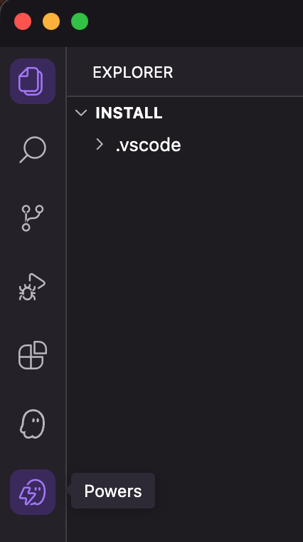
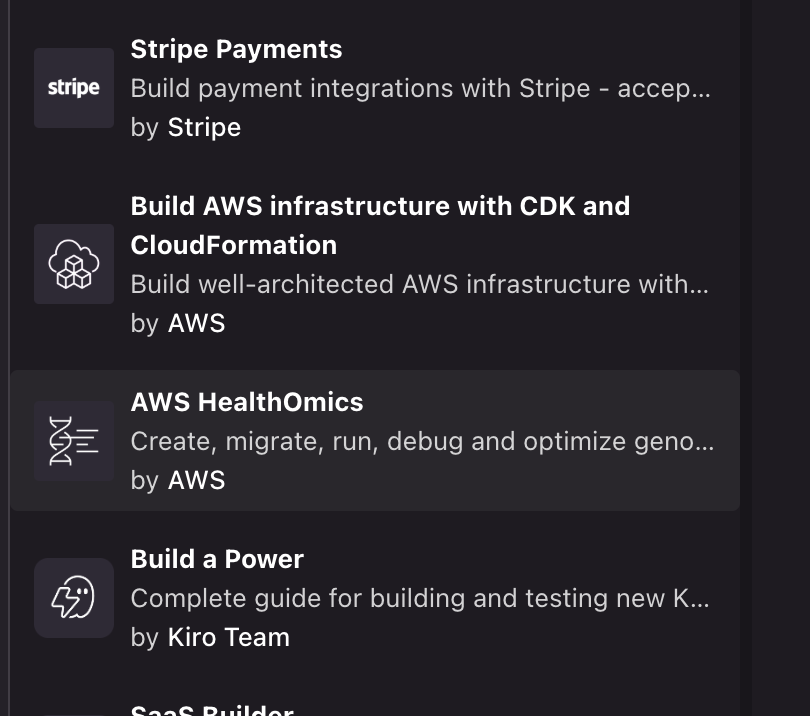
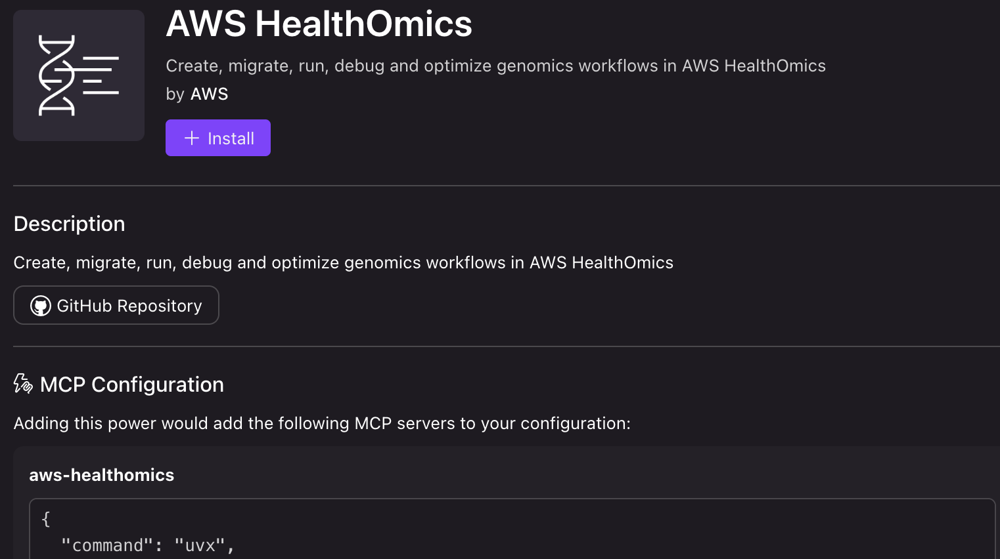
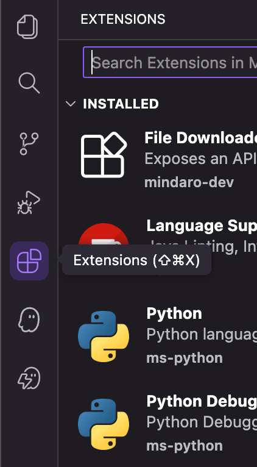
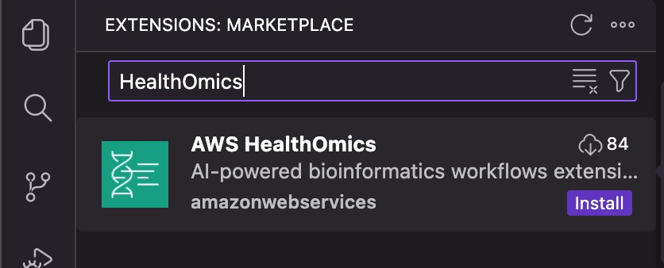
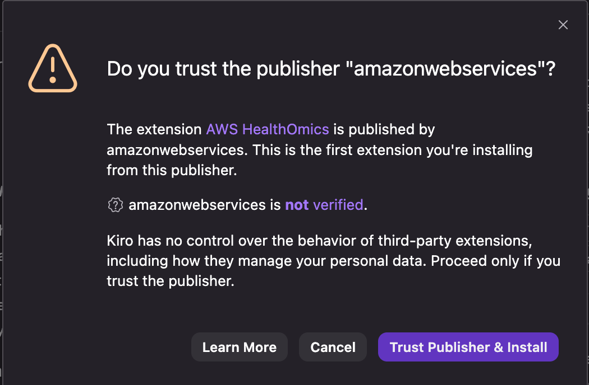

# Kiro IDE Integration

The AWS HealthOmics service offers a Kiro Power and a Kiro IDE Extension for the [Kiro IDE](https://kiro.dev/). Although, each can be installed and function independently, using both together provides the best user experience.

## Install the HealthOmics Kiro Power

To install the HealthOmics Kiro Power:

  1. Open Kiro
  2. Click on the Powers Icon in the Activity Bar
  
     
  
  3. In the Recommended section of the Powers navigator, find the AWS HealthOmics Power
  
     
  
  4. Click install
  
     

## Install the HealthOmics Kiro Extension

  1. Click on the Extensions Icon in the Activity Bar
  
     
  
  2. Search for the AWS HealthOmics extension and click install
  
     
  
  3. Assert the publisher is "amazonwebservices" then click "Trust Publisher and Install"
  
     

