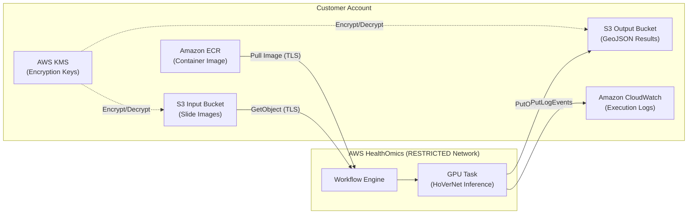

# HealthOmics WSI Nuclei Segmentation Workflow

A WDL workflow that runs GPU-accelerated nuclei segmentation and classification on H&E whole-slide images (WSI). Runs exclusively in [AWS HealthOmics](https://aws.amazon.com/healthomics/) using the [HoVerNet](https://arxiv.org/abs/1812.06499) model from the [MONAI Model Zoo](https://github.com/Project-MONAI/model-zoo). Detects, segments, and classifies nuclei into 4 types: Inflammatory, Epithelial, Spindle-Shaped, and Miscellaneous. Outputs standard GeoJSON files compatible with pathology viewers like [QuPath](https://qupath.github.io/).

## Quick Start

1. Build and push the container to Amazon Elastic Container Registry (Amazon ECR) (see [Building and Deploying the Container](#building-and-deploying-the-container))
2. Deploy the workflow to HealthOmics using `nuclei_segmentation.wdl`
3. Start a run with your parameters

## Parameters

| Parameter | Type | Required | Default | Description |
|-----------|------|----------|---------|-------------|
| `slide_image` | File | Yes | — | Amazon Simple Storage Service (Amazon S3) URI of the SVS whole-slide image |
| `container_image_uri` | String | Yes | — | ECR container image URI |
| `pyramid_level` | Int | No | `0` | OpenSlide pyramid level (0 = highest resolution) |
| `tile_size` | Int | No | `512` | Square tile size in pixels (128–1024) |
| `overlap` | Int | No | `tile_size/4` | Pixel overlap between adjacent tiles |
| `max_tiles` | Int | No | all | Limit number of tiles processed (useful for testing) |
| `roi_geojson` | File | No | — | GeoJSON FeatureCollection with Polygon geometries for ROI filtering |

## Workflow Outputs

| Output | Description |
|--------|-------------|
| `nuclei_geojson` | GeoJSON with nuclei contours, classifications, and centroids |
| `tissue_mask_geojson` | GeoJSON grid showing tissue/non-tissue tiles |
| `task_log` | Execution log with timing, resource usage, and diagnostics |

## Pipeline Architecture

```
SVS Slide → Tile Grid → [ROI Filter] → Tissue Detection → GPU Inference (HoVerNet) → Postprocessing → GeoJSON
```

The pipeline:
1. Opens the SVS slide at the specified pyramid level
2. Generates an overlapping tile grid
3. Optionally filters tiles against ROI polygons
4. Skips blank/background tiles via tissue detection
5. Runs batched GPU inference with HoVerNet
6. Postprocesses with multi-process workers
7. Stitches results using centroid-based deduplication (no boundary artifacts)
8. Outputs nuclei contours and tissue mask as GeoJSON

## Security Architecture



### Security Design Considerations

- **Network isolation**: HealthOmics runs in RESTRICTED networking mode — no outbound internet access from the task container
- **Data in transit**: All S3 and ECR communication uses TLS 1.2+
- **Data at rest**: S3 buckets should use SSE-KMS encryption (see [Data Security](#data-security) section)
- **Container security**: Images are pulled from private ECR with scan-on-push enabled
- **Least privilege**: AWS Identity and Access Management (IAM) role scoped to specific bucket ARNs and log group patterns


### Per-Service Security Guidelines

- **Amazon S3**: Enable Block Public Access, SSE-KMS, versioning, access logging, and TLS enforcement. See the [S3 Security Best Practices](#s3-security-best-practices) section for detailed configuration commands.
- **Amazon ECR**: Enable scan-on-push, use immutable image tags, and restrict repository policy to the HealthOmics service principal.
- **Amazon CloudWatch**: Scope log group permissions, enable log group encryption with KMS, and set retention policies.
- **AWS HealthOmics**: Use RESTRICTED networking mode (default), and scope the IAM role to minimum required permissions.

## Creating the Workflow

Package and create the workflow using the AWS CLI:

```bash
zip workflow.zip nuclei_segmentation.wdl

aws omics create-workflow \
    --name nuclei-segmentation \
    --definition-zip fileb://workflow.zip \
    --parameter-template file://parameter-template.json
```

## Starting a Run

### Basic Run

```bash
ACCOUNT_ID=$(aws sts get-caller-identity --query Account --output text)
WORKFLOW_ID=<your-workflow-id>

aws omics start-run \
    --workflow-id $WORKFLOW_ID \
    --role-arn arn:aws:iam::${ACCOUNT_ID}:role/YourHealthOmicsRole \
    --output-uri s3://your-output-bucket/results/ \
    --storage-type DYNAMIC \
    --parameters '{
        "slide_image": "s3://your-input-bucket/slide.svs",
        "container_image_uri": "'${ACCOUNT_ID}'.dkr.ecr.us-east-1.amazonaws.com/healthomics-hovernet:latest"
    }'
```

### Run with ROI Filtering

Upload your ROI GeoJSON to S3, then pass it as an additional parameter:

```bash
aws omics start-run \
    --workflow-id $WORKFLOW_ID \
    --role-arn arn:aws:iam::${ACCOUNT_ID}:role/YourHealthOmicsRole \
    --output-uri s3://your-output-bucket/results/ \
    --storage-type DYNAMIC \
    --parameters '{
        "slide_image": "s3://your-input-bucket/slide.svs",
        "container_image_uri": "'${ACCOUNT_ID}'.dkr.ecr.us-east-1.amazonaws.com/healthomics-hovernet:latest",
        "roi_geojson": "s3://your-input-bucket/roi.geojson"
    }'
```

### Run with Parameters File

```bash
aws omics start-run \
    --workflow-id $WORKFLOW_ID \
    --role-arn arn:aws:iam::${ACCOUNT_ID}:role/YourHealthOmicsRole \
    --output-uri s3://your-output-bucket/results/ \
    --storage-type DYNAMIC \
    --parameters file://inputs.json
```

## ROI Filtering

When an ROI GeoJSON file is provided, the pipeline processes only tiles whose center falls inside at least one ROI polygon. This can dramatically reduce processing time for large slides where only specific regions are of interest.

The ROI file must be a standard GeoJSON FeatureCollection with Polygon geometries. Coordinates are in pixel space at the target pyramid level. Compatible with annotation exports from QuPath, ASAP, and similar tools.

**ROI GeoJSON format:**

```json
{
  "type": "FeatureCollection",
  "features": [
    {
      "type": "Feature",
      "geometry": {
        "type": "Polygon",
        "coordinates": [[[100, 200], [300, 200], [300, 400], [100, 400], [100, 200]]]
      },
      "properties": {
        "label": "Tumor Region"
      }
    }
  ]
}
```

When ROI filtering is active, the output GeoJSON metadata includes:
- `roi_filtering: true`
- `roi_polygon_count`: number of ROI polygons used
- `roi_skipped_tiles`: number of tiles excluded by the filter

## Output Format

Nuclei are output as GeoJSON Polygon features with properties:

```json
{
  "nucleus_id": 1,
  "classification": "Epithelial",
  "type_code": 3,
  "centroid_x": 1024.5,
  "centroid_y": 2048.3,
  "area_px": 156
}
```

Nuclear type codes: 1 = Miscellaneous, 2 = Inflammatory, 3 = Epithelial, 4 = Spindle-Shaped.

## Model

Uses HoVerNet (fast mode) from the MONAI Model Zoo v0.2.8:
- Input: 256×256 RGB patches
- Output: 164×164 segmentation + classification maps
- Training data: CoNSeP dataset
- Binary Dice: 0.83
- License: Apache 2.0

The model weights are baked into the container image (~144 MB).

## AI/ML Compliance

> **⚠️ Not for Clinical Use**: This workflow is NOT intended for patient diagnosis, clinical decision-making, or any medical purpose. It is provided as a research and development example only. Any use in a clinical setting requires independent validation, regulatory approval, and oversight by qualified medical professionals.

### Model Provenance

- **Model**: HoVerNet (fast mode) from the MONAI Model Zoo v0.2.8
- **Source**: https://github.com/Project-MONAI/model-zoo
- **License**: Apache 2.0
- **Training data**: CoNSeP dataset (Colorectal Nuclear Segmentation and Phenotypes)
- **Original paper**: Graham et al., "HoVer-Net: Simultaneous Segmentation and Classification of Nuclei in Multi-Tissue Histology Images," Medical Image Analysis, 2019

### Dataset Compliance

- CoNSeP dataset is licensed under CC BY-NC-SA 4.0 (Creative Commons Attribution-NonCommercial-ShareAlike 4.0)
- Commercial use of the trained model weights may require separate licensing consideration
- The dataset contains 41 H&E stained image tiles from 16 colorectal adenocarcinoma WSIs
- Users should verify dataset licensing requirements for their specific use case

### Bias and Fairness Considerations

- The model was trained exclusively on colorectal adenocarcinoma tissue (CoNSeP dataset)
- Performance may vary on other tissue types, staining protocols, or scanner manufacturers
- The training data represents a limited demographic and geographic sample
- Users should evaluate model performance on their specific tissue types and patient populations before drawing conclusions
- No formal bias assessment or fairness metrics have been published for this model

### Model Integrity Verification

- Model weights are baked into the container image at build time
- Pin container images using digest references (e.g., `@sha256:...`) rather than mutable tags for reproducibility
- Enable ECR image scanning to detect vulnerabilities in the container
- Verify container image integrity:

```bash
aws ecr describe-images \
  --repository-name healthomics-hovernet \
  --image-ids imageTag=latest \
  --query 'imageDetails[0].imageDigest'
```

## AWS Permissions

### IAM Service Role

The HealthOmics service role needs the following permissions. This workflow does not require VPC networking — it uses only S3 and ECR, which are accessible in the default RESTRICTED networking mode.

**S3 (input and output):**
- `s3:GetObject` on the input bucket (slide image and optional ROI file)
- `s3:PutObject`, `s3:GetObject` on the output bucket

**ECR (container image):**
- `ecr:GetDownloadUrlForLayer`, `ecr:BatchGetImage`, `ecr:BatchCheckLayerAvailability`

**CloudWatch Logs:**
- `logs:CreateLogGroup`, `logs:CreateLogStream`, `logs:PutLogEvents`

### Example IAM Policy

```json
{
  "Version": "2012-10-17",
  "Statement": [
    {
      "Sid": "S3InputAccess",
      "Effect": "Allow",
      "Action": [
        "s3:GetObject"
      ],
      "Resource": [
        "arn:aws:s3:::YOUR_INPUT_BUCKET/*"
      ]
    },
    {
      "Sid": "S3OutputAccess",
      "Effect": "Allow",
      "Action": [
        "s3:PutObject",
        "s3:GetObject"
      ],
      "Resource": [
        "arn:aws:s3:::YOUR_OUTPUT_BUCKET/*"
      ]
    },
    {
      "Sid": "S3ListBuckets",
      "Effect": "Allow",
      "Action": [
        "s3:ListBucket"
      ],
      "Resource": [
        "arn:aws:s3:::YOUR_INPUT_BUCKET",
        "arn:aws:s3:::YOUR_OUTPUT_BUCKET"
      ]
    },
    {
      "Sid": "ECRAccess",
      "Effect": "Allow",
      "Action": [
        "ecr:GetDownloadUrlForLayer",
        "ecr:BatchGetImage",
        "ecr:BatchCheckLayerAvailability"
      ],
      "Resource": [
        "arn:aws:ecr:*:ACCOUNT_ID:repository/healthomics-hovernet"
      ]
    },
    {
      "Sid": "CloudWatchLogs",
      "Effect": "Allow",
      "Action": [
        "logs:CreateLogGroup",
        "logs:CreateLogStream",
        "logs:PutLogEvents"
      ],
      "Resource": "arn:aws:logs:REGION:ACCOUNT_ID:log-group:/aws/omics/*"
    }
  ]
}
```

> **Note:** The ECR repository also needs a resource policy granting `omics.amazonaws.com` pull access. The `build_and_push_container.sh` script sets this automatically.

## S3 Security Best Practices

Secure the S3 buckets used for workflow input and output with the following configurations.

### Block Public Access

Enable Block Public Access on each bucket to prevent accidental public exposure:

```bash
aws s3api put-public-access-block \
  --bucket YOUR_BUCKET_NAME \
  --public-access-block-configuration BlockPublicAcls=true,IgnorePublicAcls=true,BlockPublicPolicy=true,RestrictPublicBuckets=true
```

### TLS Enforcement

Add a bucket policy condition to deny any requests that do not use HTTPS:

```json
{
  "Sid": "DenyInsecureTransport",
  "Effect": "Deny",
  "Principal": "*",
  "Action": "s3:*",
  "Resource": [
    "arn:aws:s3:::YOUR_BUCKET_NAME",
    "arn:aws:s3:::YOUR_BUCKET_NAME/*"
  ],
  "Condition": {
    "Bool": { "aws:SecureTransport": "false" }
  }
}
```

### Encryption at Rest

Amazon S3 enables SSE-S3 encryption by default. For medical imaging workloads, SSE-KMS is recommended for additional key management controls:

```bash
aws s3api put-bucket-encryption \
  --bucket YOUR_BUCKET_NAME \
  --server-side-encryption-configuration '{
    "Rules": [{"ApplyServerSideEncryptionByDefault": {"SSEAlgorithm": "aws:kms"}}]
  }'
```

### Access Logging

Enable server access logging to track requests to your bucket:

```bash
aws s3api put-bucket-logging \
  --bucket YOUR_BUCKET_NAME \
  --bucket-logging-status '{
    "LoggingEnabled": {"TargetBucket": "YOUR_LOG_BUCKET", "TargetPrefix": "s3-access-logs/"}
  }'
```

### Versioning

Enable versioning for data protection and recovery:

```bash
aws s3api put-bucket-versioning \
  --bucket YOUR_BUCKET_NAME \
  --versioning-configuration Status=Enabled
```

### Validation

Verify each configuration with the following commands:

```bash
aws s3api get-public-access-block --bucket YOUR_BUCKET_NAME
aws s3api get-bucket-encryption --bucket YOUR_BUCKET_NAME
aws s3api get-bucket-versioning --bucket YOUR_BUCKET_NAME
aws s3api get-bucket-logging --bucket YOUR_BUCKET_NAME
```

## Data Security

### Encryption at Rest

Amazon S3 SSE-KMS is recommended for medical imaging data to provide additional key management controls and audit capabilities beyond the default SSE-S3 encryption. See the [S3 Security Best Practices](#s3-security-best-practices) section for CLI commands to configure bucket-level encryption.

Amazon ECR images are encrypted at rest by default using Amazon S3 server-side encryption, so container images containing model weights are protected without additional configuration.

### KMS Key Management

Create a dedicated AWS KMS key for the nuclei segmentation workflow to isolate encryption controls and simplify auditing:

```bash
aws kms create-key --description "HealthOmics nuclei segmentation workflow"
aws kms enable-key-rotation --key-id YOUR_KEY_ID
```

Key management recommendations:

- Enable automatic key rotation (rotates annually)
- Restrict the key policy to grant access only to the HealthOmics service role and designated administrators
- Use separate keys for different data classification levels if processing both PHI and non-PHI data
- Monitor key usage via AWS CloudTrail

### Data Classification

Guidance for handling medical imaging data in this workflow:

- Whole-slide images (WSI) may contain Protected Health Information (PHI) depending on embedded metadata such as patient name, accession number, or scan date
- Customers are responsible for determining if their data is subject to HIPAA or other regulatory requirements
- Strip patient identifiers from slide metadata before processing to minimize PHI exposure in workflow outputs
- Use separate S3 buckets for input (raw slides) and output (analysis results) to apply different access controls and retention policies based on data sensitivity

### Access Logging and Auditing

Enable comprehensive logging to maintain an audit trail for compliance:

- **S3 server access logging**: Track all object-level requests to input and output buckets. See the [S3 Security Best Practices](#s3-security-best-practices) section for configuration commands.
- **AWS CloudTrail**: Enable API-level auditing to capture all AWS API calls related to the workflow, including S3, KMS, and HealthOmics operations.
- **Amazon CloudWatch Logs**: Workflow execution logs are already captured via the CloudWatch Logs permissions in the IAM policy.

Enable CloudTrail for API-level auditing:

```bash
aws cloudtrail create-trail \
  --name nuclei-segmentation-audit \
  --s3-bucket-name YOUR_TRAIL_BUCKET \
  --is-multi-region-trail
```

## Security Checklist

Complete the following security configurations before running the workflow in production. Items are ordered by priority.

### P0 — Critical

| # | Action | Command | Validation |
|---|--------|---------|------------|
| 1 | Enable S3 Block Public Access | `aws s3api put-public-access-block --bucket YOUR_BUCKET --public-access-block-configuration BlockPublicAcls=true,IgnorePublicAcls=true,BlockPublicPolicy=true,RestrictPublicBuckets=true` | `aws s3api get-public-access-block --bucket YOUR_BUCKET` |
| 2 | Enforce TLS on S3 bucket | Add `aws:SecureTransport` deny policy (see [S3 Security Best Practices](#s3-security-best-practices)) | `aws s3api get-bucket-policy --bucket YOUR_BUCKET` |
| 3 | Scope IAM CloudWatch Logs resource | Use `arn:aws:logs:REGION:ACCOUNT_ID:log-group:/aws/omics/*` (see [IAM Policy](#example-iam-policy)) | Review IAM policy JSON |

### P1 — High

| # | Action | Command | Validation |
|---|--------|---------|------------|
| 4 | Enable S3 SSE-KMS encryption | `aws s3api put-bucket-encryption --bucket YOUR_BUCKET --server-side-encryption-configuration '{"Rules":[{"ApplyServerSideEncryptionByDefault":{"SSEAlgorithm":"aws:kms"}}]}'` | `aws s3api get-bucket-encryption --bucket YOUR_BUCKET` |
| 5 | Enable S3 versioning | `aws s3api put-bucket-versioning --bucket YOUR_BUCKET --versioning-configuration Status=Enabled` | `aws s3api get-bucket-versioning --bucket YOUR_BUCKET` |
| 6 | Enable S3 access logging | `aws s3api put-bucket-logging --bucket YOUR_BUCKET --bucket-logging-status '{"LoggingEnabled":{"TargetBucket":"YOUR_LOG_BUCKET","TargetPrefix":"s3-access-logs/"}}'` | `aws s3api get-bucket-logging --bucket YOUR_BUCKET` |
| 7 | Enable ECR scan-on-push | `aws ecr put-image-scanning-configuration --repository-name healthomics-hovernet --image-scanning-configuration scanOnPush=true` | `aws ecr describe-repositories --repository-names healthomics-hovernet --query 'repositories[0].imageScanningConfiguration'` |

### P2 — Recommended

| # | Action | Command | Validation |
|---|--------|---------|------------|
| 8 | Create dedicated KMS key | `aws kms create-key --description "HealthOmics nuclei segmentation"` | `aws kms describe-key --key-id YOUR_KEY_ID` |
| 9 | Enable KMS key rotation | `aws kms enable-key-rotation --key-id YOUR_KEY_ID` | `aws kms get-key-rotation-status --key-id YOUR_KEY_ID` |
| 10 | Enable CloudTrail | `aws cloudtrail create-trail --name nuclei-segmentation-audit --s3-bucket-name YOUR_TRAIL_BUCKET --is-multi-region-trail` | `aws cloudtrail get-trail-status --name nuclei-segmentation-audit` |
| 11 | Pin container image by digest | Use `@sha256:...` instead of `:latest` in `container_image_uri` | `aws ecr describe-images --repository-name healthomics-hovernet --image-ids imageTag=latest --query 'imageDetails[0].imageDigest'` |

## Shared Responsibility Model

This workflow operates under the [AWS Shared Responsibility Model](https://aws.amazon.com/compliance/shared-responsibility-model/). Security responsibilities are divided between AWS and the customer.

### AWS Responsibilities

AWS manages security **of** the cloud:

- AWS HealthOmics compute environment isolation between customers
- RESTRICTED networking mode enforcement (no outbound internet from workflow tasks)
- Physical infrastructure security for compute, storage, and networking
- Amazon S3, Amazon ECR, and Amazon CloudWatch service-level encryption and availability
- Patch management for managed service infrastructure

### Customer Responsibilities

Customers manage security **in** the cloud:

- **IAM policies**: Configuring least-privilege roles for HealthOmics workflow execution
- **S3 bucket security**: Enabling Block Public Access, SSE-KMS encryption, TLS enforcement, versioning, and access logging
- **Encryption key management**: Creating and rotating KMS keys, restricting key policies
- **Container image security**: Scanning images for vulnerabilities, pinning image digests, keeping base images updated
- **Data classification**: Determining if slide images contain PHI and applying appropriate controls
- **Access logging and auditing**: Enabling CloudTrail, S3 access logs, and CloudWatch log retention
- **Network controls**: Configuring VPC endpoints if using PRIVATE networking mode
- **Incident response**: Monitoring for unauthorized access and responding to security events

## Building and Deploying the Container

### Build Locally

```bash
./build_container.sh
```

### Push to ECR

```bash
./build_and_push_container.sh \
  --account-id 123456789012 \
  --region us-east-1 \
  --repo healthomics-hovernet
```

See [DOCKER_BUILD_INSTRUCTIONS.md](DOCKER_BUILD_INSTRUCTIONS.md) for detailed instructions including manual steps, architecture notes, and troubleshooting.

## Directory Structure

```
├── nuclei_segmentation.wdl        # WDL workflow definition
├── process_wsi.py                  # Pipeline script (HoVerNet inference + postprocessing)
├── Dockerfile                      # Container definition
├── requirements.txt                # Python dependencies
├── bundles/                        # MONAI model bundle (HoVerNet weights)
├── build_container.sh              # Local container build script
├── build_and_push_container.sh     # Build + ECR push script
├── inputs.json                     # Example input parameters
├── parameter-template.json         # Parameter definitions for workflow creation
├── parameter-description.json      # Parameter descriptions with use-case examples
├── DOCKER_BUILD_INSTRUCTIONS.md    # Detailed container build/push guide
├── LICENSE                         # Apache 2.0 license
└── README.md                       # This file
```

## Runtime

The WDL task requests:
- **CPU**: 8 cores
- **Memory**: 32 GiB
- **GPU**: 1× nvidia-t4-a10g-l4
- **Storage**: DYNAMIC

Typical processing time depends on slide size, pyramid level, and ROI coverage. A full slide at level 0 with ~10,000 tissue tiles takes approximately 30–60 minutes. Using ROI filtering or a lower pyramid level reduces processing time proportionally.

## Troubleshooting

### GPU not detected
- Check the task log for `CUDA available: False`
- Verify the WDL runtime specifies `acceleratorCount: 1` and `acceleratorType: "nvidia-t4-a10g-l4"`
- Verify the container was built with CUDA-enabled PyTorch

### OpenSlide cannot open slide
- Verify the slide file is a valid SVS format
- Check that the HealthOmics role has `s3:GetObject` permission on the input bucket
- The task log will show `Error: cannot open slide` with the specific OpenSlide error

### Out of memory during inference
- Reduce `tile_size` (e.g., 256 instead of 512)
- Set `max_tiles` to limit the number of tiles processed
- Use ROI filtering to process only regions of interest

### Unsupported slide format
- The pipeline uses OpenSlide, which supports SVS, TIFF, NDPI, VMS, SCN, and other formats
- SVS is the most tested format
- If your format is not supported, convert to SVS first

### ROI file format errors
- The ROI file must be a valid GeoJSON FeatureCollection
- Only Polygon geometries are supported (other types are skipped with a warning)
- Coordinates must be in pixel space at the target pyramid level
- Verify the file is valid JSON (use `python -m json.tool roi.geojson` to validate)

### Pipeline produces empty output
- Check the task log for tissue detection results — if no tiles have sufficient tissue, the output will be empty
- Try lowering the tissue detection threshold by processing at a different pyramid level
- Verify the slide contains H&E-stained tissue

## License

This project is licensed under the Apache License 2.0. See [LICENSE](LICENSE) for details.

The HoVerNet model weights are from the [MONAI Model Zoo](https://github.com/Project-MONAI/model-zoo) (Apache 2.0). The model metadata notes it is provided as an example and is not intended for diagnostic purposes.

## References

- Graham et al., "HoVer-Net: Simultaneous Segmentation and Classification of Nuclei in Multi-Tissue Histology Images," Medical Image Analysis, 2019. [arXiv:1812.06499](https://arxiv.org/abs/1812.06499)
- [MONAI Project](https://monai.io/)
- [AWS HealthOmics Documentation](https://docs.aws.amazon.com/omics/)
